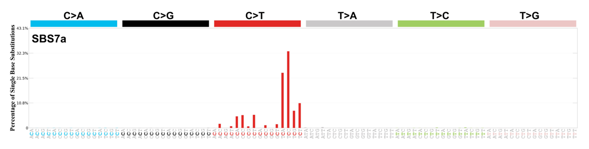

# Autoencoders for mutational signatures extraction

## Introduction 
Mutational signatures are distinct patterns of mutations that result from specific biological processes or external environmental factors.

When we refer to mutations, we mean changes in the DNA sequence of an allele, one of the two copies of a gene that we inherit from our parents.

When analyzing mutations in normal tissue, we compare them to the reference genome, which represents the most common sequence of the human genome. Mutations can be classified into two main categories:

- **Germline mutations**: Inherited from our parents and present in every cell of the body.
- **Somatic mutations**: Acquired during a person's lifetime and not inherited.
Since cancer is driven by the accumulation of mutations, identifying common patterns across different patients is crucial for understanding tumor development.

In mutational signature analysis, we specifically focus on somatic mutations, which arise during a patient’s lifetime rather than being inherited. These mutations can be caused by different factors, including environmental exposures, defective DNA repair mechanisms or endogenous (internal) processes.

Mutational processes can be broadly classified into two categories:
- **Endogenous mutational processes** (e.g. DNA replication errors, defective DNA repair mechanisms)
- **Exogenous mutational processes** (e.g. exposure to ultraviolet light, tobacco smoke)

Understanding mutational signatures is particularly useful for devising personalized patient treatment, as different mutations are linked to specific causes of tumorigenesis. 
### Mutational contexts
In this project we'll focus on the analysis of single base substitutions (SBS), which involve the mutation of a single nucleotide in the DNA sequence within a specific context. The context refers to the bases immediately before and after the mutated base. 

If two consecutive bases are mutated, we refer to them as double base substitutions (DBSs). Other types of mutations, such as insertions and deletions (indels), exist but will not be considered in this project.

Single base substitutions can be classified into six types, depending on the type of base substitution:
- C>A (cytosine to adenine)
- C>G (cytosine to guanine)
- C>T (cytosine to thymine)
- T>A (thymine to adenine)
- T>C (thymine to cytosine)
- T>G (thymine to guanine)

The context of a mutation is crucial, as the surrounding bases can influence the likelihood of a mutation occurring. 
This results in 96 possible combinations (6 types of base substitutions $\times$ 4 possible bases before $\times$ 4 possible bases after the mutated base).
Thus, an SBS mutation is classified based on its specific trinucleotide context.

If we define a probability vector $p_i$, where each element represents the probability of observing mutation type $i$ in a given signature. The
matrix $W$ contains these probabilities for each mutational signature, ensuring that the sum of the elements in each column is equal to 1.

The following image shows an example of a mutational signature associated with U-V light mutational processes.

A catalog of known mutational sginatures can be found in the [COSMIC database](https://cancer.sanger.ac.uk/signatures), which is used as a reference for comparing and identifying new signatures.
## Project overview
Signatures can be represented as a matrix factorization problem, where the data matrix, consisting of non-negative counts of mutations in each trinucleotide context, is factorized into two non-negative matrices: the signature matrix and the exposure matrix. 
Throught this project we want to extract these two lower rank matrices, with a special focus on autoencoders.

The data we used is from the Genomics England 100,000 Genomes Project(GEL) and is composed of 523 whole genome sequences from ovarian cancer patients.

Firstly, as a benchmark, we used NMF to extract the signature and exposure  matrices, this is the most common method used for this task.

Then, we explored the use of autoencoders, starting with a shallow autoencoder with non-negativity constraints. It can be proven that this model is equivalent to Convex NMF, a special case of NMF.
Since the activation function is identity, this autoencoder is also equivalent to PCA. A dimensionality recduction technique that identifies a set of orthogonal axes, called principal components, that capture the maximum variance in the data.

Finally, we implemented a more complex non-linear autoencoder,inspired by the MUSE-XAE architecture. This might be able to identify non-linear relationships between the data that are not captured by NMF.
Furthermore we consider a loss based on the Poisson distribution, which is more suitable for count data. 
Also regularization techniques could be employed to encourage the extraction of signatures that aren't overly similar to each other (distinctive features in the latent space).
Also in this case the number of signatures to be extracted is chosen through a complex selction procedure.
Finally it's important to note that the input data was augmented through a multinomial bootstrapping procedure, to improve the generalization of the model.

The results should provide insights into the performance of autoencoders compared to the classical NMF methods, and potentially identify non-linear relationships between the data that are not captured by NMF.
## Data 
- Description of the data
  - [GEL Ovary cancer data](data/catalogues_Ovary_SBS.tsv) 523 whole genome sequences freely available on [Zenodo](https://zenodo.org/records/5571551) . 

## Authors

- [Nicola Cortinovis](https://github.com/NicolaCortinovis)
- [Marta Lucas](https://github.com/15Max)
- [Annalisa Paladino](https://github.com/annalisapaladino)

Checkout our brief [presentation](Presentation.pdf) for an overview of the project.

## References 
- [On the Relation Between Autoencoders and Non-negative Matrix
Factorization, and Their Application for Mutational Signature
Extraction ; Egendal et al. (2024)](references/AENMF.pdf)
- [Decoding whole-genome mutational signatures in 37 human
pan-cancers by denoising sparse autoencoder neural network; Pei et al. (2020)](references/Denoising.pdf)
- [MUSE-XAE: MUtational Signature Extraction with
eXplainable AutoEncoder enhances tumour types
classification; Pancotti et al. (2024)](references/MUSE_XAE.pdf)

  
